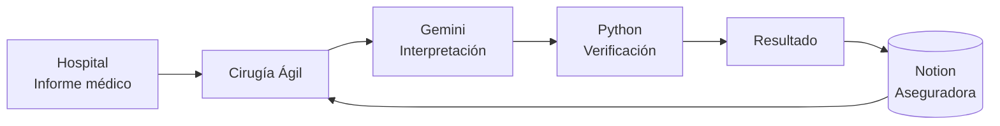

# Cirugía Ágil

Agente de preautorización quirúrgica asistido por inteligencia artificial.

> MVP desarrollado para automatizar la revisión preliminar de solicitudes
> de cirugía mediante información clínica proveniente del hospital y datos
> de pólizas y coberturas administrados por la aseguradora en Notion.

---

## Descripción

Actualmente, la autorización de una cirugía puede requerir horas o días
debido a la revisión manual de información clínica, pólizas, períodos de
carencia y documentación requerida.

**Cirugía Ágil** propone un agente capaz de realizar una evaluación
preliminar automáticamente.

El sistema recibe un informe médico digital proveniente del hospital y,
a partir del número de póliza, consulta en Notion la información del
asegurado, la vigencia de la póliza, el plan contratado, las coberturas,
los períodos de carencia y los documentos exigidos por la aseguradora.

Gemini interpreta la información documental y posteriormente un motor
de reglas desarrollado en Python verifica las condiciones antes de
emitir un resultado.

---

## Objetivo del MVP

El MVP demuestra un flujo funcional de preautorización capaz de:

- recibir un informe médico digital;
- identificar al paciente y su póliza;
- consultar información de la aseguradora almacenada en Notion;
- determinar si el procedimiento solicitado está cubierto;
- verificar la vigencia de la póliza;
- calcular el cumplimiento del período de carencia;
- comprobar los documentos requeridos;
- detectar documentación faltante;
- generar una preaprobación preliminar;
- registrar automáticamente el resultado en Notion;
- conservar evidencia de cada comprobación realizada.

---

## Arquitectura



La arquitectura sigue el principio:

> **IA interpreta → Python verifica → el agente decide → Notion registra**

Gemini no determina por sí solo la decisión final.

La IA se utiliza para interpretar y estructurar la información contenida
en los documentos. Posteriormente, reglas deterministas desarrolladas
en Python validan la evidencia, fechas, carencia, cobertura y requisitos.

---

## Fuentes de información

### Hospital

El hospital proporciona el informe médico digital y, cuando corresponde,
documentos adicionales como:

- orden quirúrgica;
- ultrasonido;
- resonancia;
- estudios diagnósticos;
- otros documentos requeridos.

Estos archivos son cargados al agente desde la interfaz web.

### Aseguradora

La información administrativa se encuentra estructurada en Notion.

El MVP utiliza cuatro bases:

#### Pacientes

Contiene la identificación del asegurado y su número de póliza.

#### Pólizas

Contiene:

- número de póliza;
- paciente asociado;
- plan;
- estado;
- fecha de inicio;
- fecha de vencimiento.

#### Coberturas

Contiene:

- plan;
- procedimiento;
- código;
- condición de cobertura;
- período de carencia;
- documentos requeridos;
- exclusiones.

#### Solicitudes

Registra automáticamente los resultados procesados por el agente.

---

## Flujo de evaluación


---

## Tecnologías

### Backend

- Python
- FastAPI
- Uvicorn
- HTTPX
- Pydantic

### Inteligencia artificial

- Gemini API
- Gemini 3.6 Flash

### Base de datos / aseguradora

- Notion API

### Frontend

- HTML
- CSS
- JavaScript

### Persistencia del MVP

- almacenamiento local para historial y originales;
- Notion para registrar las solicitudes evaluadas.

---

## Prueba rápida con los samples

El repositorio incluye archivos ficticios dentro de:

```text
samples/
```

Los datos corresponden a:

```text
Paciente: Ana Ejemplo
ID: PAC-001
Póliza: POL-001
Procedimiento: Reparación de hernia inguinal
```

Para las pruebas se utiliza como fecha prevista de cirugía:

```text
2026-10-15
```

### Caso 1 — Documentos faltantes

Utilizar:

**Número de póliza**

```text
POL-001
```

**Fecha de cirugía**

```text
2026-10-15
```

**Informe médico**

```text
samples/informe_hernia.txt
```

No adjuntar documentos adicionales.

#### Resultado esperado

```text
DOCUMENTOS_FALTANTES
```

El agente identifica que el procedimiento está cubierto, la póliza está
vigente y el período de carencia se cumplió, pero detecta la ausencia de:

- Orden quirúrgica
- Ultrasonido

---

### Caso 2 — Preaprobación

Utilizar:

**Número de póliza**

```text
POL-001
```

**Fecha de cirugía**

```text
2026-10-15
```

**Informe médico**

```text
samples/informe_hernia.txt
```

Agregar como documentos adicionales:

```text
samples/orden_quirurgica.txt
samples/ultrasonido.txt
```

#### Resultado esperado

```text
PREAPROBADO
```

El agente verifica:

- ✓ Identidad del asegurado
- ✓ Número de póliza
- ✓ Vigencia
- ✓ Cobertura del procedimiento
- ✓ Período de carencia
- ✓ Informe médico
- ✓ Orden quirúrgica
- ✓ Ultrasonido

y registra automáticamente el resultado en la base
**Solicitudes** de Notion.

---

## Ejemplo de carencia

Para `POL-001`:

```text
Inicio de cobertura: 2025-01-01
Carencia requerida: 180 días
Fecha de cirugía: 2026-10-15
```

El motor de reglas calcula automáticamente los días transcurridos y
determina si el requisito fue cumplido.

---

## Ejecución local

Clonar el repositorio:

```bash
git clone <URL_DEL_REPOSITORIO>
cd cirugia-agil
```

Crear un entorno virtual:

```bash
python -m venv .venv
```

En Windows:

```powershell
.\.venv\Scripts\Activate.ps1
```

Instalar dependencias:

```bash
pip install -r requirements.txt
```

Crear:

```text
.env
```

tomando como referencia:

```text
.env.example
```

Configurar las credenciales de Gemini y Notion.

Iniciar:

```bash
uvicorn app.main:app --host 127.0.0.1 --port 8000
```

Abrir:

```text
http://127.0.0.1:8000
```

---

## Variables de entorno

```env
GEMINI_API_KEY=
GEMINI_MODEL=gemini-3.6-flash
GEMINI_TIMEOUT_SECONDS=120

NOTION_TOKEN=

NOTION_PATIENTS_DATA_SOURCE_ID=
NOTION_POLICIES_DATA_SOURCE_ID=
NOTION_COVERAGES_DATA_SOURCE_ID=
NOTION_REQUESTS_DATA_SOURCE_ID=
NOTION_DATA_SOURCE_ID=
```

> **Importante:** nunca deben almacenarse claves o tokens reales dentro del repositorio.

---

## Cargar datos de demostración en Notion

El proyecto incluye un script para crear datos ficticios de demostración:

```bash
python scripts/seed_notion.py
```

El script genera automáticamente pacientes, pólizas y coberturas
de prueba y evita duplicar los registros existentes.

La base **Solicitudes** no necesita ser poblada manualmente porque
el agente la completa automáticamente después de cada análisis.

---

## Estructura principal

```text
cirugia-agil/
│
├── app/
│   ├── main.py
│   ├── ai.py
│   ├── notion.py
│   ├── rules.py
│   ├── documents.py
│   ├── storage.py
│   └── config.py
│
├── static/
│   ├── index.html
│   ├── app.js
│   └── styles.css
│
├── samples/
│   ├── informe_hernia.txt
│   ├── orden_quirurgica.txt
│   └── ultrasonido.txt
│
├── scripts/
│   ├── seed_notion.py
│   ├── test_agent_ai.py
│   ├── test_notion_read.py
│   └── test_notion_write.py
│
├── tests/
│
├── .env.example
├── .gitignore
├── requirements.txt
├── render.yaml
└── README.md
```

---

## Estados del agente

### `PREAPROBADO`

Las comprobaciones implementadas fueron satisfechas y la documentación
requerida está disponible.

### `DOCUMENTOS_FALTANTES`

Las condiciones principales pueden cumplirse, pero faltan uno o más
documentos requeridos.

### `REVISION_HUMANA`

La información disponible es insuficiente, contradictoria o ambigua para
emitir automáticamente un resultado.

### `NO_CUBIERTO`

El procedimiento no forma parte de la cobertura configurada para el plan.

---

## Trazabilidad

Cada evaluación conserva las comprobaciones realizadas junto con la
evidencia documental utilizada.

Ejemplo:

```text
Cobertura del procedimiento
✓ Verificado

Póliza:
"Procedimiento: Reparación de hernia inguinal
Cubierto: Sí"

Informe:
"Procedimiento solicitado:
Reparación de hernia inguinal."
```

Esto permite explicar por qué el agente produjo cada resultado.

---

## Limitaciones del MVP

**Cirugía Ágil** es un prototipo académico.

No sustituye:

- una autorización oficial de una aseguradora;
- una evaluación médica;
- una revisión legal;
- procesos clínicos o administrativos reales.

Los resultados generados son exclusivamente preevaluaciones
demostrativas.

---

## Seguridad

Las credenciales de Gemini y Notion se gestionan mediante variables
de entorno y no deben almacenarse en Git.

Para demostraciones públicas se recomienda utilizar exclusivamente
datos ficticios.

---

## Resultado

El MVP demuestra cómo un proceso que tradicionalmente requiere revisión
manual puede convertirse en un flujo automatizado:

```text
Hospital
   ↓
Informe médico
   ↓
Cirugía Ágil
   ↙       ↘
Gemini    Notion
   ↘       ↙
Motor de reglas
   ↓
Preautorización
   ↓
Notion
```
